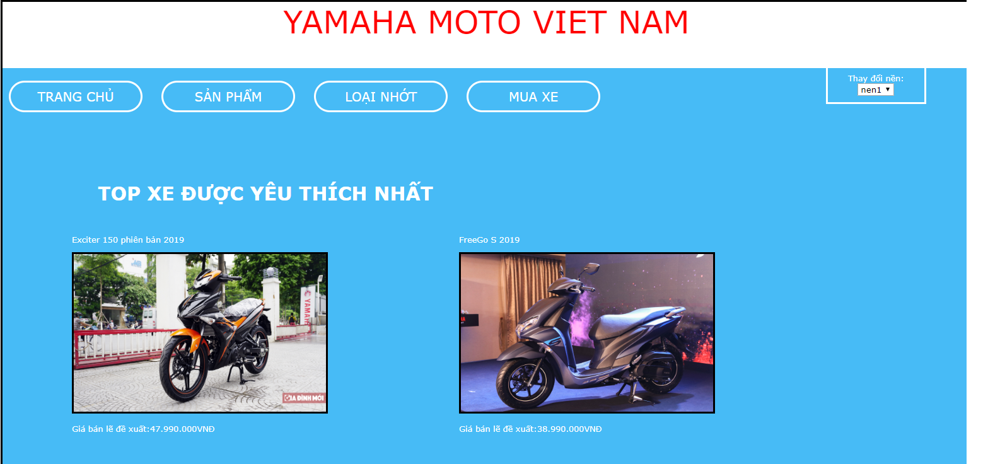
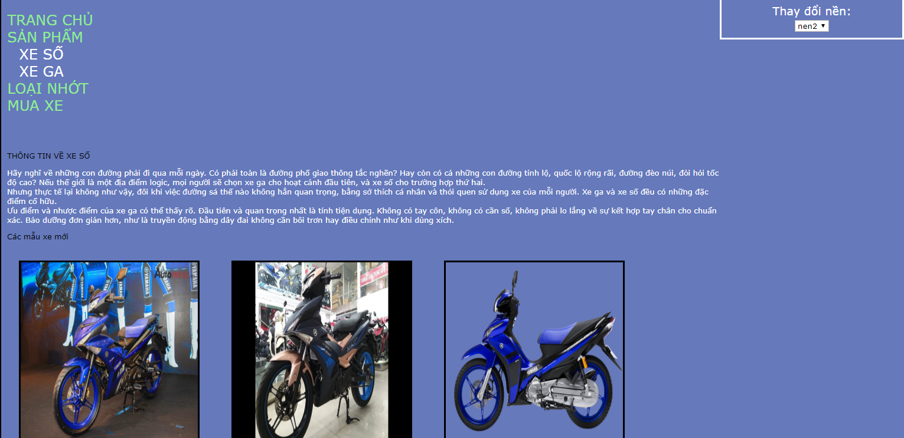
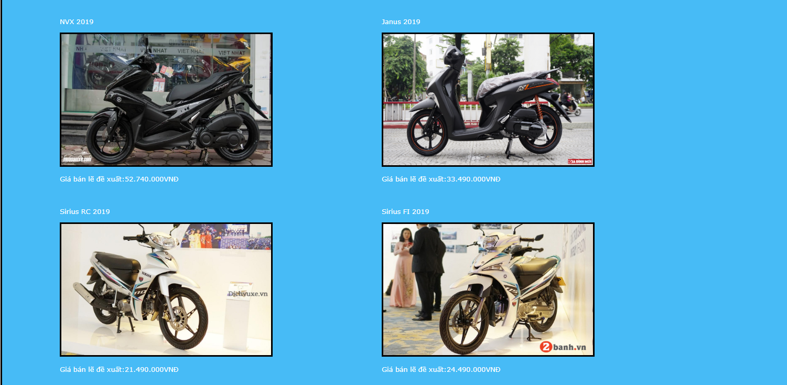
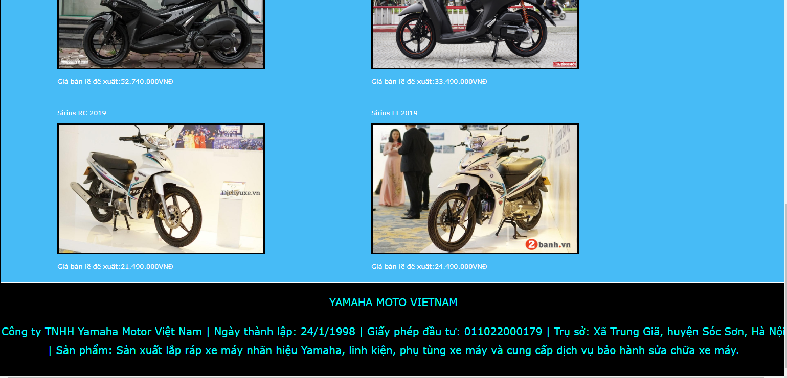
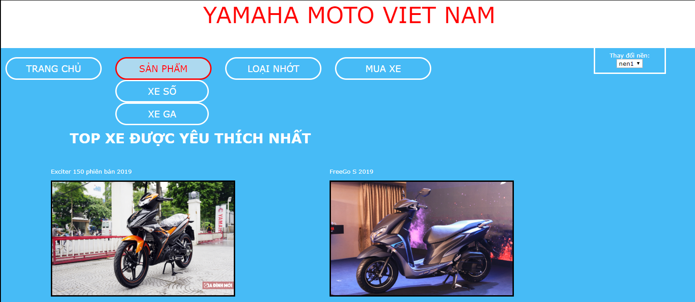
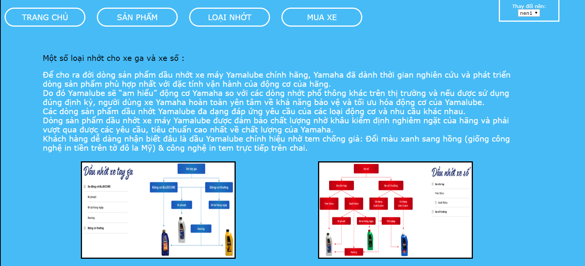
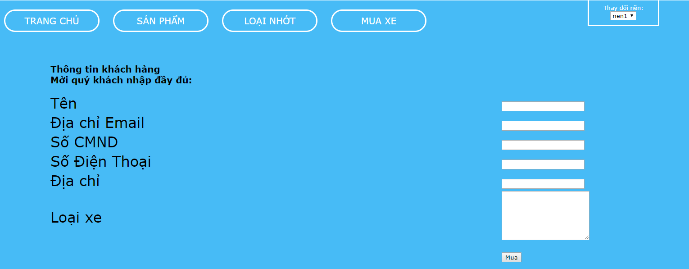
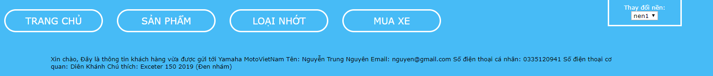
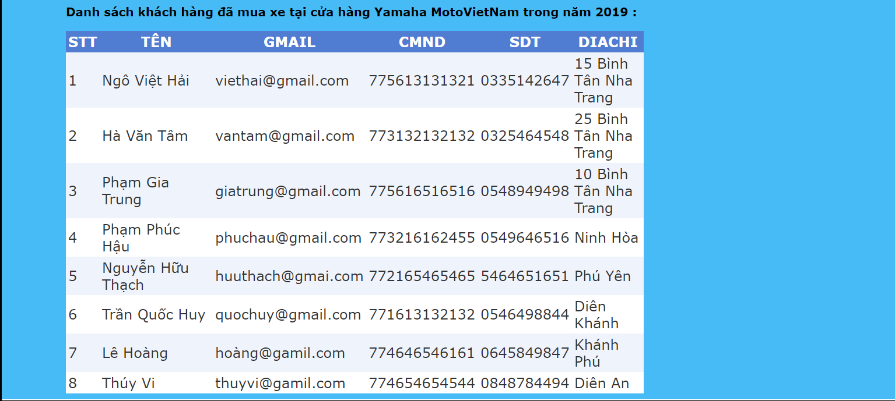

<h1> Trang web bán xe máy Yamaha Moto Việt Nam </h1>  

 1. Trang web được thiết kế có thể thay đổi giữa 2 phong nền khác nhau tạo sự mới mẽ khi bạn ghé trang web để tra thông tin xe mà bạn muốn mua 
  

 2. Ở nền 1 : Phong nền chủ yếu là nền màu xanh dương nhạt . 
  

3   

4. Ở nền 2 : Phong nền chủ yếu là nền màu tím nhạt.
  
 
5  

   
6. Trang chủ được trưng bày những loại xe được người dùng ưa chuộng hiện nay , có thể nói là hot hất hiện nay .
  
   7  
   8  
   9  

   10. Bạn rê chuột sang phần sản phẩm và đừng vội click chuột vào nó mà hãy đợi nó hiện ra 2 sự lựa chọn đó là XE SỐ vs Xe GA .  

   11   

   12. Khi bạn đã xem thông tin chi tiết của từng loại xe ở 2 phần XE SỐ vs XE GA kia thì tiếp theo hãy sang tiếp phần LOẠI NHỚT .  

   13.  Cũng như ở phần SẢN PHẨM được chia ra làm 2 phần là XE SỐ vs XE GA thì ở LOẠI NHỚT cũng được chia làm 2 phần là NHỚT XE GA vs NHỚT XE SỐ .  

  14   

  15. Kế tiếp tới phần MUA XE : muốn mua xe thì khách hàng cần nhập đầy đủ và chính xác các thông tin mà cửa hàng đã đề ra .  

   16   

   17. Sau khi nhập xong và nhấn MUA thì sẽ hiện ra một dòng thông bạn đã nhập và đã được gửi tới cho cửa hàng chúng tôi . 

   18   

   19. Dưới cùng là danh sách các khách hàng đã mua xe tại cửa hàng trong năm 2019 để bạn xem thêm .  

   20   

 21. Chân thành cảm ơn bạn đã xem qua phần giới thiệu về trang web bán xe của cửa hàng chúng tôi 
 
